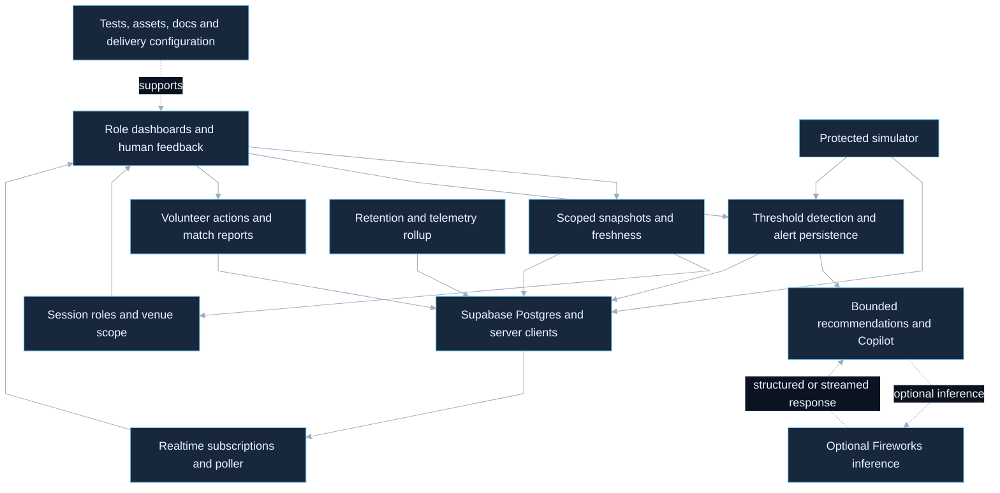

# Source coverage register

Snapshot: `f935f1f487d93a56e40314a31c50d8b88a36accb`. Current hosted source; previous local snapshot `05ed97ed62766b51e3ce11cc757ce3794295358d` is historical.

## File accounting

153 tracked paths, assigned exactly once. Runtime clusters, tests, schema, assets and configuration are explicitly listed. This does not prove every execution path or dynamically loaded service.

### Assets, entry points and configuration

- `.env.example`
- `.github/workflows/ci.yml`
- `.gitignore`
- `.vscode/settings.json`
- `AGENTS.md`
- `README.md`
- `components.json`
- `eslint.config.mjs`
- `next.config.ts`
- `package-lock.json`
- `package.json`
- `postcss.config.mjs`
- `scripts/evaluate-prompts.mjs`
- `scripts/reset-demo-scenario.mjs`
- `scripts/seed-demo.mjs`
- `scripts/verify-alert-loop.mjs`
- `scripts/verify-copilot-retention.mjs`
- `scripts/verify-hosted-p0.mjs`
- `scripts/verify-hosted-p1.mjs`
- `scripts/verify-live-prompt-injection.mjs`
- `scripts/verify-live-submission.mjs`
- `scripts/verify-public-app.mjs`
- `scripts/verify-role-access.mjs`
- `tsconfig.json`
- `vercel.json`

### Documentation

- `docs/01_product_requirement_document.md`
- `docs/02_technical_requirement_document.md`
- `docs/03_app_flow.md`
- `docs/04_ui_ux_design_brief.md`
- `docs/05_backend_schema.md`
- `docs/06_implementation_plan.md`
- `docs/07_security_plan.md`
- `docs/08_project_backlog.md`
- `docs/09_verification_report.md`
- `docs/README.md`
- `docs/architecture/pulseops.mmd`
- `docs/architecture/pulseops.png`

### Runtime modules

- `src/app/(dashboard)/layout.tsx`
- `src/app/(dashboard)/ops/alerts/page.tsx`
- `src/app/(dashboard)/ops/page.tsx`
- `src/app/(dashboard)/overview/page.tsx`
- `src/app/(dashboard)/sustainability/page.tsx`
- `src/app/(dashboard)/volunteers/page.tsx`
- `src/app/api/alerts/[id]/handle/route.ts`
- `src/app/api/alerts/route.ts`
- `src/app/api/check-alerts/route.ts`
- `src/app/api/copilot/route.ts`
- `src/app/api/demo-login/route.ts`
- `src/app/api/maintenance/copilot-retention/route.ts`
- `src/app/api/maintenance/telemetry-rollup/route.ts`
- `src/app/api/ops/snapshot/route.ts`
- `src/app/api/reports/match-summary/route.ts`
- `src/app/api/resource-advisor/route.ts`
- `src/app/api/simulate-tick/route.ts`
- `src/app/api/sustainability-advisor/route.ts`
- `src/app/api/venues/compare/route.ts`
- `src/app/api/volunteers/[id]/reassign/route.ts`
- `src/app/error.tsx`
- `src/app/global-error.tsx`
- `src/app/globals.css`
- `src/app/layout.tsx`
- `src/app/login/page.tsx`
- `src/app/page.tsx`
- `src/app/robots.ts`
- `src/app/sitemap.ts`
- `src/app/unauthorized/page.tsx`
- `src/components/auth/login-client.tsx`
- `src/components/copilot/chat-bubble.tsx`
- `src/components/copilot/copilot-panel.tsx`
- `src/components/dashboard-poller.tsx`
- `src/components/dashboard/ai-suggestion-card.tsx`
- `src/components/dashboard/data-freshness-badge.tsx`
- `src/components/dashboard/gate-throughput-trend.tsx`
- `src/components/dashboard/grounded-recommendation-card.tsx`
- `src/components/dashboard/lib/telemetry-utils.ts`
- `src/components/dashboard/live-metric-gauge-grid.tsx`
- `src/components/dashboard/live-sustainability-dashboard.tsx`
- `src/components/dashboard/metric-gauge-grid.tsx`
- `src/components/dashboard/metric-gauge.tsx`
- `src/components/dashboard/ops-command-center.tsx`
- `src/components/dashboard/resource-advisor-panel.tsx`
- `src/components/dashboard/status-badge.tsx`
- `src/components/dashboard/sustainability-advisor-panel.tsx`
- `src/components/dashboard/sustainability-trend.tsx`
- `src/components/dashboard/trend-line.tsx`
- `src/components/dashboard/volunteer-deployment-summary.tsx`
- `src/components/dashboard/zone-heatmap.tsx`
- `src/components/layout/dashboard-keyboard-shortcuts.tsx`
- `src/components/layout/operator-context-banner.tsx`
- `src/components/layout/role-nav.tsx`
- `src/components/layout/venue-scope-selector.tsx`
- `src/components/realtime-page-refresh.tsx`
- `src/components/theme/theme-provider.tsx`
- `src/components/theme/theme-toggle.tsx`
- `src/components/ui/empty-state.tsx`
- `src/components/ui/primitives.tsx`
- `src/hooks/use-realtime-alerts.ts`
- `src/hooks/use-realtime-gate-scans.ts`
- `src/hooks/use-realtime-sustainability.ts`
- `src/hooks/use-realtime-volunteers.ts`
- `src/hooks/use-realtime-zone-telemetry.ts`
- `src/hooks/useSimulatePoll.ts`
- `src/lib/ai/alert-recommendation.ts`
- `src/lib/ai/client.ts`
- `src/lib/ai/config.ts`
- `src/lib/ai/copilot-context.ts`
- `src/lib/ai/copilot-prompt.ts`
- `src/lib/ai/resource-advisor.ts`
- `src/lib/ai/sustainability-advisor.ts`
- `src/lib/alerts/check-alerts.ts`
- `src/lib/api/contracts.ts`
- `src/lib/auth/roles.ts`
- `src/lib/auth/venue-scope-policy.ts`
- `src/lib/auth/venue-scope.ts`
- `src/lib/maintenance/retention-policy.ts`
- `src/lib/observability/safe-log.ts`
- `src/lib/ops/freshness.ts`
- `src/lib/ops/load-snapshot.ts`
- `src/lib/ops/recommendations.ts`
- `src/lib/ops/snapshot.ts`
- `src/lib/ops/types.ts`
- `src/lib/realtime/reducers.ts`
- `src/lib/reports/match-summary.ts`
- `src/lib/security/rate-limit.ts`
- `src/lib/security/system-route-auth.ts`
- `src/lib/supabase/client.ts`
- `src/lib/supabase/server.ts`
- `src/lib/supabase/service-role.ts`
- `src/lib/utils.ts`
- `src/proxy.ts`
- `src/types/database.ts`

### Supabase schema and functions

- `supabase/migrations/0001_init.sql`
- `supabase/migrations/0002_seed.sql`
- `supabase/migrations/0003_user_roles_and_realtime.sql`
- `supabase/migrations/0004_seed_volunteers.sql`
- `supabase/migrations/0005_fix_sustainability_read_policy.sql`
- `supabase/migrations/0006_p0_security_and_auditability.sql`
- `supabase/migrations/0007_ensure_realtime_publication.sql`
- `supabase/migrations/0008_operator_recommendation_feedback.sql`
- `supabase/migrations/0009_user_venue_access.sql`
- `supabase/migrations/0010_venue_scoped_rls.sql`
- `supabase/migrations/0011_telemetry_rollups.sql`
- `supabase/migrations/0012_venue_policy_cleanup.sql`
- `supabase/migrations/0013_harden_venue_access_function.sql`
- `supabase/migrations/0014_rls_and_index_hardening.sql`

### Tests

- `tests/api-contracts.test.mjs`
- `tests/auth-policy.test.mjs`
- `tests/copilot-context.test.mjs`
- `tests/realtime-reducers.test.mjs`
- `tests/reports.test.mjs`
- `tests/resource-advisor.test.mjs`
- `tests/retention-policy.test.mjs`
- `tests/venue-scope-and-snapshot.test.mjs`
